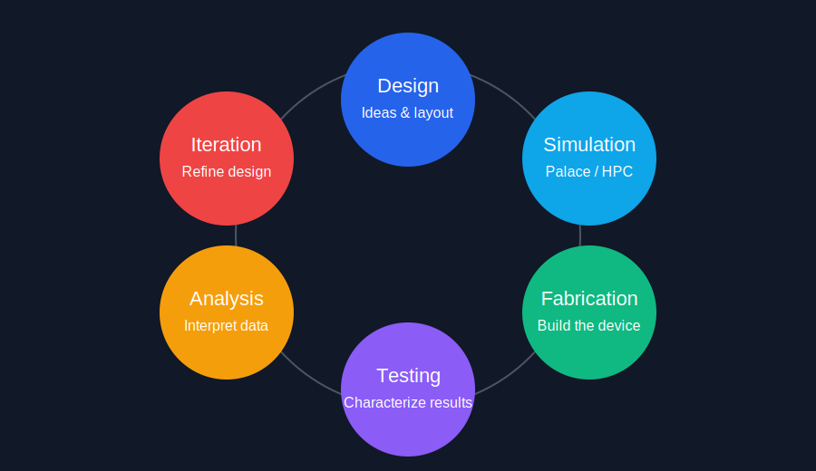

### Who I Am

I worked at Amazon supporting the Center for Quantum Computing (CQC).

{fig-align="center"}

### Amazon CQC

### Designing Superconducting Qubit Chips

{fig-align="center" width="90%"}s

### Palace

> Palace, for PArallel LArge-scale Computational Electromagnetics, is an open-source, parallel finite element code for full-wave 3D electromagnetic simulations in the frequency or time domain, using the MFEM finite element discretization library and libCEED library for efficient exascale discretizations.

### Palace (Meshing)

### Palace (Simulation)

### Intro

How do we design an HPC environment on AWS for quantum-device simulation?

Requirements:

::: {.fragment .fade-up}
1. On-demand compute for bursty workloads
:::

::: {.fragment .fade-up}
2. HPC Scheduler / Queue for Palace simulations and other workflows
:::

::: {.fragment .fade-up}
3. Interactive desktops for analysis and visualization
:::

::: {.fragment .fade-up}
4. Secure and reliable environment for real research
:::

### Burtsy Workloads

A key constraint was that workloads were bursty.

Researchers often needed:

- Large instances on short notice (100+ c7gn nodes per simulation)
- Interactive desktops for analysis and visualization
- GPU capacity for visualization and related work
- Shared software environments for HPC and desktop work

Always on nodes would have been too expensive, and the demand was not predictable enough to rely on reserved capacity.

### SOCA Architecture

### SOCA Improvements

Generally five categories of improvements were needed:

- Better AMI (Amazon Machine Images) images and build process
- Architectural improvements through updating the codebase
- Security and authentication improvements
- AI / workflow improvements
- Palace / Spack improvements

### AMIs Improvements

1. Improve the process for building AMIs

::: {.fragment .fade-in-then-out}
- AMI builder scripts didn't have `set -x`, so I added that for better debugging
- Some gnuutils libraries are blocked in us-east-1, so we had to move to building AMIs in us-east-2, and copying them to to other regions
:::

::: {.fragment .fade-up}
2. Add new features to the AMIs
:::

::: {.fragment .fade-in-then-out}
- GPU support was added, requiring navigation of NVDIA drivers
- Updating things like gcc and other packages to support newer instance types
:::

::: {.fragment .fade-up}
3. Improve load times and UX for AMIs
:::

::: {.fragment .fade-in}
- x86/arm64, GRID / TESLA, desktop / compute nodes (5 total AMIs)
- To speed up load times, needed to modify SOCA code to prevent runtime installation of some packages and to support custom AMIs
:::

### Architectural Improvements

1. Deprecate our old AL2 deployment

::: {.fragment .fade-in-then-out}
- Moving from AL2 to Ubuntu 22.04 for better VSCode support (glibc et al.)
- Port OpenLDAP from one scheduler to another, which was non-trivial
:::

::: {.fragment .fade-up}
2. Upgrade from SOCA-lite to newest version of code (3+ year gap)
:::

::: {.fragment .fade-in-then-out}
- Moving to EC2 Fleet from EC2 ASG for better spot capacity management
- Windows desktop support for windows specific software for some users
- ODCR for improved UX when Insufficient Capacity Error (ICE) occurs
:::

::: {.fragment .fade-up}
3. Additional improvements to the infrastructure
:::

::: {.fragment .fade-in-then-out}
- Queue default limits to reduce impact of problem users, improve reliability
- Increased capacity + OSTs to reduce IOPs contention, capacity alerts
:::

### Security and Auth Improvements

1. Move from OpenLDAP to AWS Managed Active Directory (MAD), adding SSO

::: {.fragment .fade-in-then-out}
- MAD removed single point of failure, easing transitions between deployments
- SSO removes passwords for auth. Implemented ALB in Typescript + patches
:::

::: {.fragment .fade-up}
2. Improvements around SOCA and AWS MAD integration
:::

::: {.fragment .fade-in-then-out}
- Clearing desktops from AD when terminated to prevent duplicate objects
- JSON based AD infromation to remove the need for compute nodes to AD join
:::

::: {.fragment .fade-up}
3. More linux related security improvements
:::

::: {.fragment .fade-in-then-out}
- Adding rootless container runtimes to SOCA, allowing for POLP
- Improving filesystem permissions to use linux groups, not `r-x` everywhere
:::

### AI / Workflow Improvementss

1. Virtual Desktop UX improvement / VSCode + Tmux

::: {.fragment .fade-in-then-out}
- Gnome desktop support, as well as network improvements to reduce latency
- Tmux + VSCode for persistent terminals when doing agentic / julia work
:::

::: {.fragment .fade-up}
2. AI related workflow improvements
:::

::: {.fragment .fade-in-then-out}
- SOCA AI plugin to reduce user pain points, giving context to documentation
- CCMT MCP, and reverse engineering for programmatic capacity queries
:::

::: {.fragment .fade-up}
3. Traditional HPC workflow improvements
:::

::: {.fragment .fade-in-then-out}
- For loops within jobs (flux), instead of for loops submitting jobs
- `/scratch` for Palace and other workflows (Python/Julia slow on Lustre)
:::

### Spack / Palace Improvements

1. Spackifying Palace

::: {.fragment .fade-in-then-out}
- Transition from CMake super-build to modular and spack based
- GHCR cache in CI to reduce builds form 1hr 15min to 15min!
- ECR as OCI storage prototyping with Spack developers
:::

::: {.fragment .fade-up}
2. Palace on EKS? Viable alternative but not spot-compute...
:::

::: {.fragment .fade-in-then-out}
- Spack OCI builds allowed container generation in GitHub CI
- Paladin for cross-region workflows using REST API + EKS backends
- Cross account VPC peering necessary for EKS integration
:::

::: {.fragment .fade-up}
3. Profiling, Performance, and Memory
:::

::: {.fragment .fade-in-then-out}
- OOM tripwire for better UX when running simulations that are "too large"
- Transition from shared to dedicated instances due to "noisy neighbour" issue
- Enabled root-less profiling on all SOCA instances
:::

### Lessons Learned

The biggest lesson was that infrastructure is not just about machines. It is about enabling a scientific workflow, and making user's lives easier.

That means paying attention to:

- What the current limitations are, and how they impact users
- Security and reliability concerns
- The overall research workflow, and how infrastructure can support it

### Questions?

{fig-align="center"}
