### Welcome!

Scan the QR code or visit the link to follow along on your laptop:

[cameronrutherford.quarto.pub/camerons-git-site/presentations/minds-matter/presentation.reveal.html](https://cameronrutherford.quarto.pub/camerons-git-site/presentations/minds-matter/presentation.reveal.html)



## Growing Up

### Australian / American Dual Citizenship

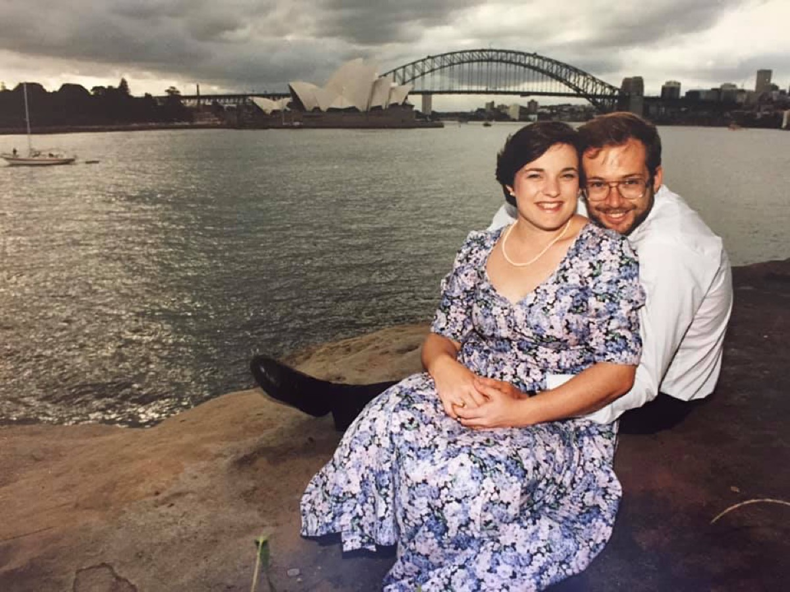{fig-align="center" height="450"}

::: {.notes}
Born in Sydney, Australia. Mum is Australian, Dad is American. Dual citizen — grew up going back and forth. Very different education systems.
:::

### Baby Cameron

{fig-align="center" height="450"}

### Basketball Was Everything

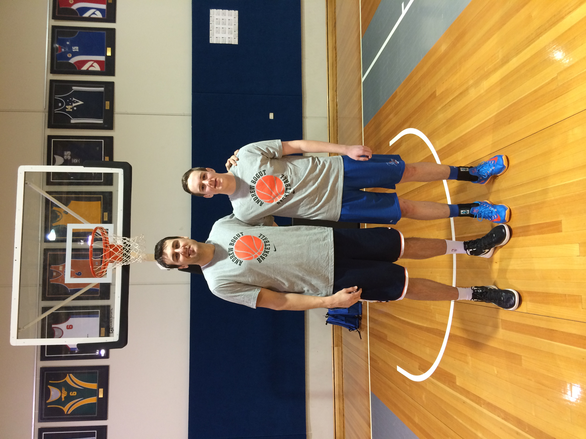{fig-align="center" height="450"}

::: {.notes}
Basketball was my life growing up. This is me at an Andrew Bogut camp — he's the #1 NBA draft pick from Australia. I was tall, loved the game, and it shaped a lot of my high school and college experience.
:::

## High School

### Sydney Grammar School

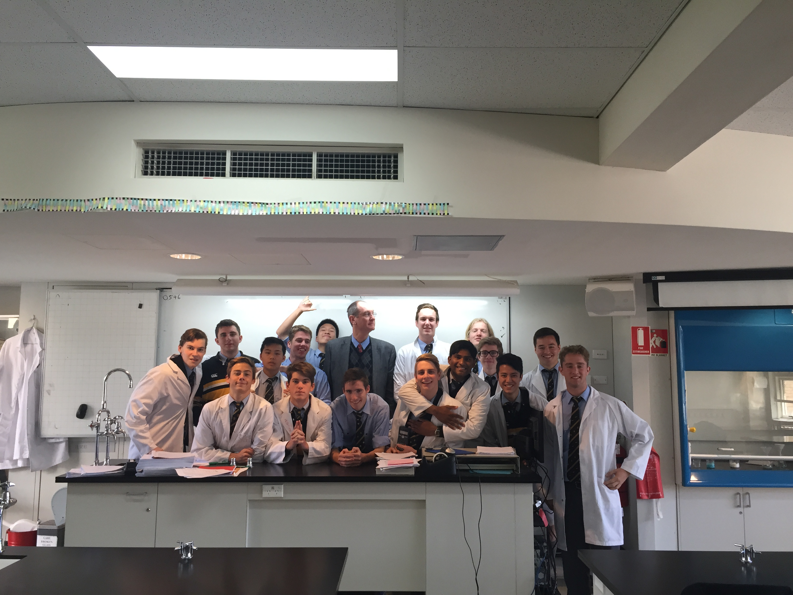{fig-align="center" height="450"}

::: {.notes}
Sydney Grammar is one of the oldest schools in Australia. Rigorous academics. This is our chemistry class — lab coats, hands-on science. Great teachers who pushed us.
:::

### CAJ Tutorial

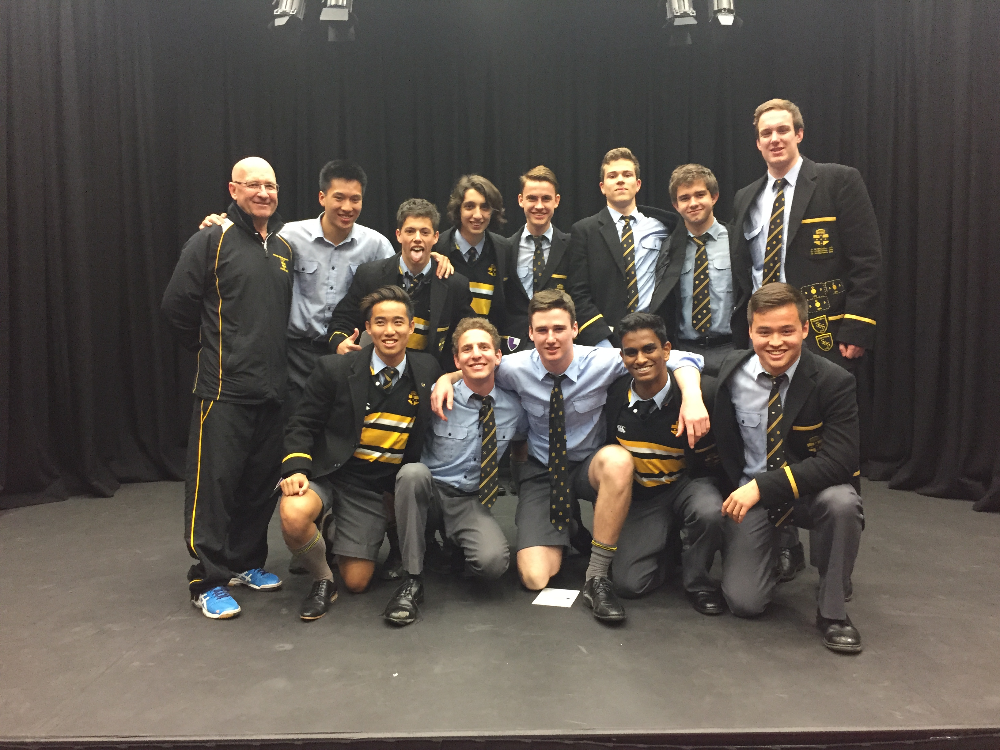{fig-align="center" height="450"}

### The ATAR & HSC

:::: {.columns}
::: {.column width="60%"}
The **HSC** (Higher School Certificate) is the final exam in New South Wales, Australia.

Your **ATAR** (Australian Tertiary Admission Rank) is a percentile rank from 0-99.95 that determines which university programs you can get into.

- Study 10+ subjects, examined over weeks of final exams
- Your entire university future rides on one set of tests
- Incredibly stressful — imagine SATs but they're your *only* metric
- I chose to come to the US instead
:::
::: {.column width="40%"}

:::
::::

::: {.notes}
This is relevant to Mind's Matter students — you're navigating college admissions too. The Australian system is arguably more stressful because it's a single number. The US system with essays, extracurriculars, and multiple chances is actually more holistic. You have more control over your story.
:::

### Basketball in Australia

:::: {.columns}
::: {.column width="50%"}
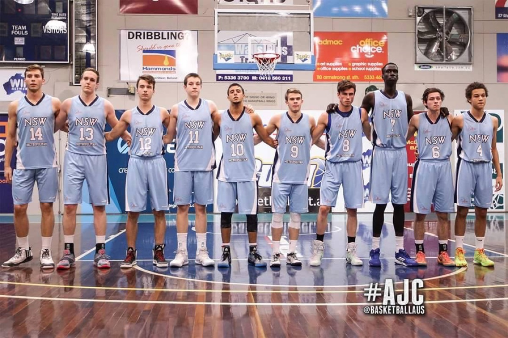{fig-align="center" height="350"}
:::
::: {.column width="50%"}
{fig-align="center" height="350"}
:::
::::

## College

### Why Whitworth University?

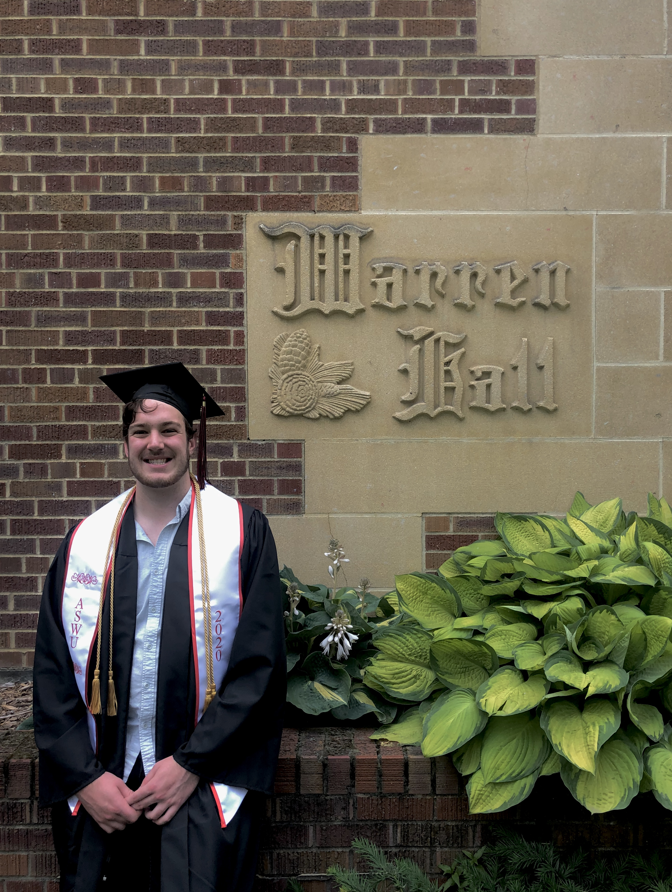{fig-align="center" height="350"}

- Small liberal arts school in Spokane, WA (2,500 students)
- Academic scholarship — Division III
- B.S. Computer Science **and** B.S. Mathematics
- Sometimes the less obvious choice is the right one

::: {.notes}
I could have stayed in Australia, gone to a big university. Instead I picked a tiny school in Spokane, Washington that most people have never heard of. It was the best decision I ever made. Small classes, great professors who knew my name, and I got to play basketball.
:::

### The Game Winner



### Storming the Court

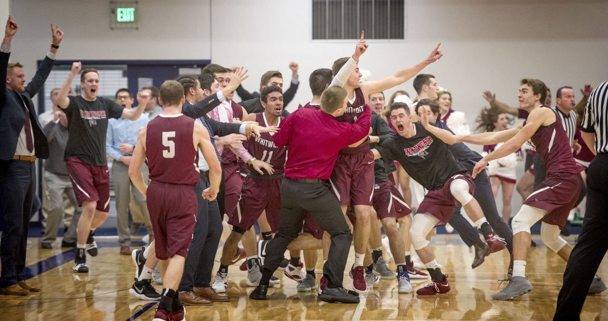{fig-align="center" height="450"}

::: {.notes}
This is the crowd storming the court after a game-winning shot in the conference championship. College basketball at a small school is special — the whole campus shows up. I played for two years, then quit the team junior year to focus on other things.
:::

### Life After Basketball

{fig-align="center" height="350"}

After leaving the basketball team junior year, I became **Chess Club President** and **Sports Events Coordinator** senior year. Also worked as a Calculus Grader and Math Tutor.

### College Fun

{fig-align="center" height="400"}

### Study Abroad — Technology & Culture

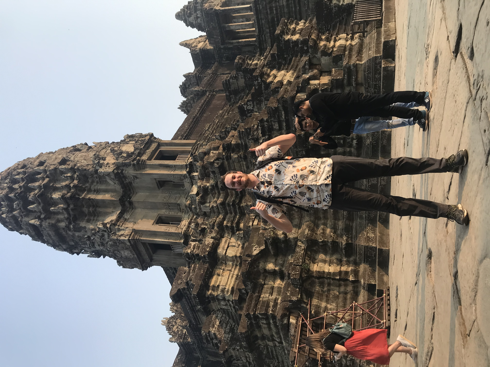{fig-align="center" height="400"}

::: {.notes}
Study abroad program called "Technology and Culture" — traveled through Southeast Asia studying how technology intersects with different cultures. Life-changing experience. This is Angkor Wat in Cambodia.
:::

### Exploring the World

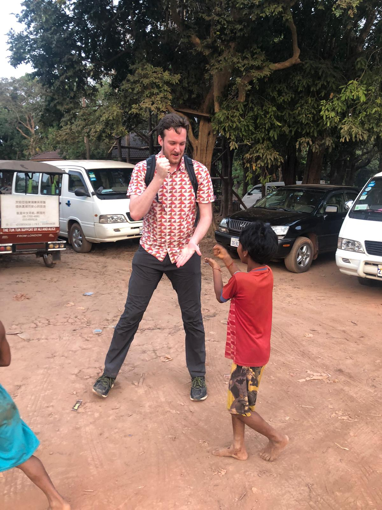{fig-align="center" height="400"}

### Club Basketball

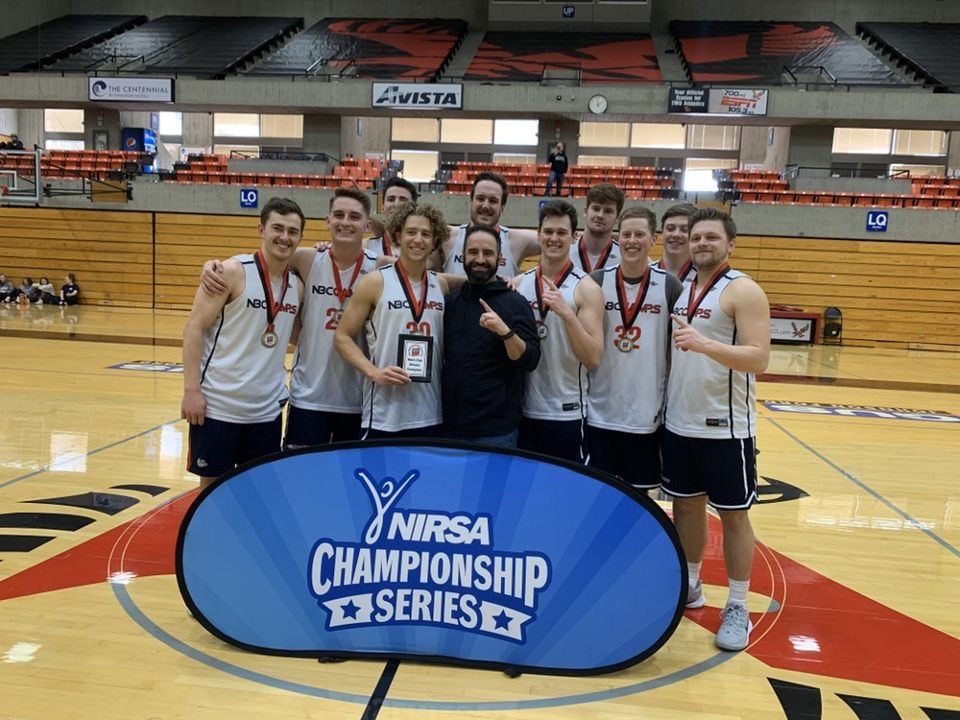{fig-align="center" height="400"}

### Near Space Research (2017)

Built and launched research payloads to the edge of space (~100,000 ft) with the Whitworth Near Space program.

### Parallel Computing & The Mandelbrot Set

{fig-align="center" height="350"}

My parallel computing class is where I fell in love with GPUs. We learned to split massive calculations across thousands of cores — this Mandelbrot fractal zoom was my final project.

### Embedded Systems — Bomb Defusal Game



Built a physical bomb defusal game using embedded systems — wires, switches, timers, the whole thing.

## Life in the US

### My Co-Worker

:::: {.columns}
::: {.column width="50%"}
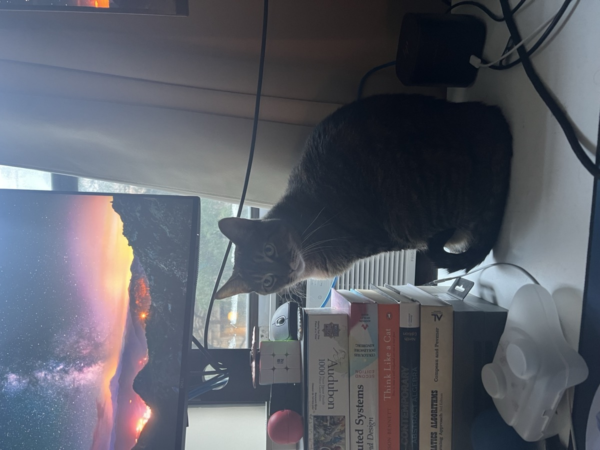{fig-align="center" height="350"}
:::
::: {.column width="50%"}
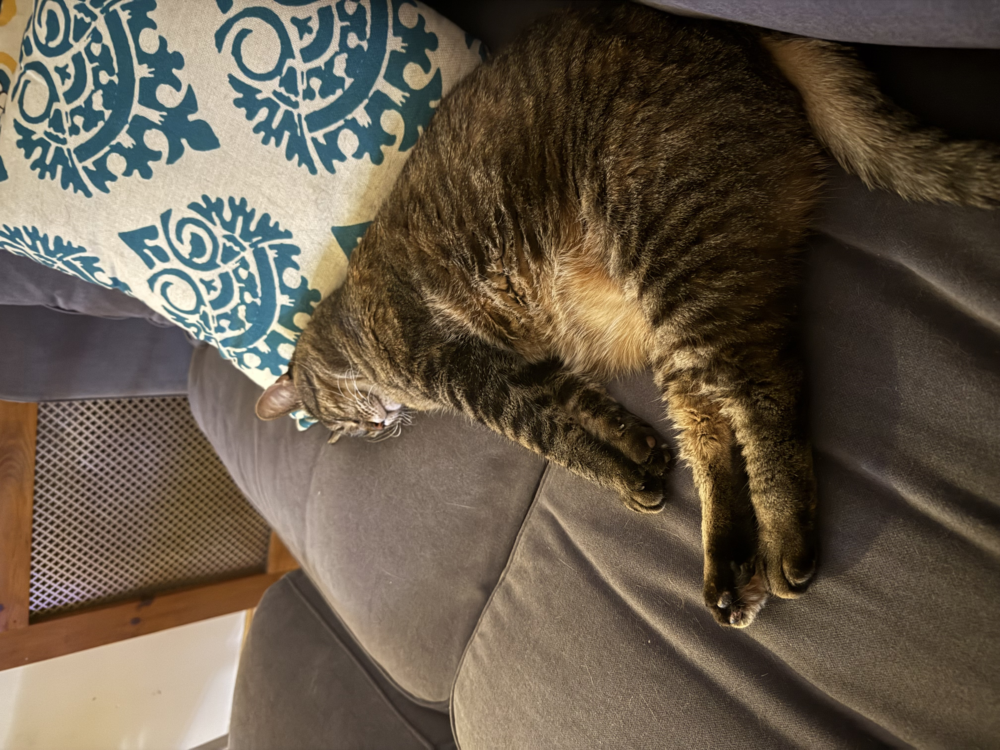{fig-align="center" height="350"}
:::
::::

::: {.notes}
This is my cat. She likes to sit on my computer science textbooks and sleep while I work. Very helpful co-worker.
:::

## Career

### PNNL — Pacific Northwest National Laboratory

:::: {.columns}
::: {.column width="50%"}
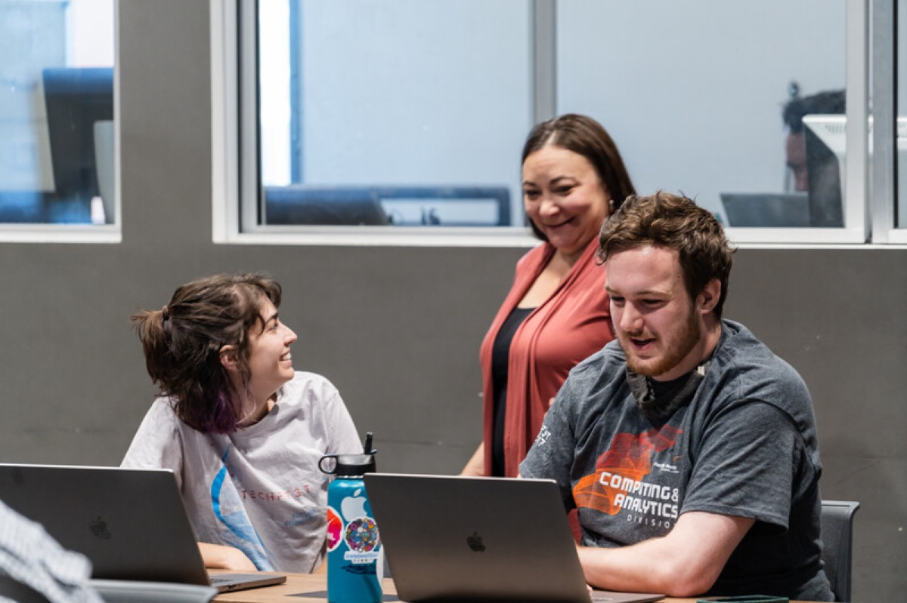{fig-align="center" height="350"}
:::
::: {.column width="50%"}
- Led software for **ExaGO** — deployed to **Frontier**, the #1 supercomputer in the world
- Worked on **E3SM** — Earth system climate modeling
- Taught workshops on quantum computing and ML
- Won PNNL's highest performance award two years in a row
:::
::::

::: {.notes}
After graduation, I went straight to a national lab — Pacific Northwest National Laboratory. Started as a student intern and worked my way up to leading projects. PNNL is one of the DOE's premier research labs.
:::

### ExaGO — Power Grid Optimization

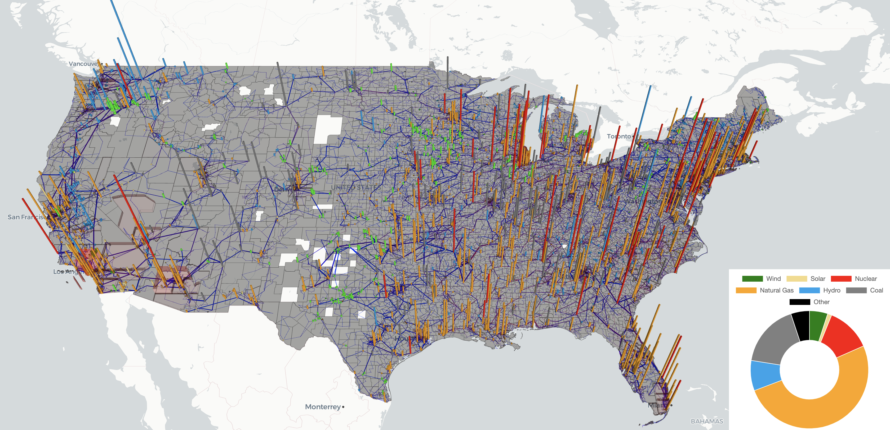{fig-align="center" height="400"}

Software to optimize the entire US power grid — running on the world's fastest supercomputers.

### E3SM — Earth System Climate Modeling



### PNNL TechFest

:::: {.columns}
::: {.column width="33%"}
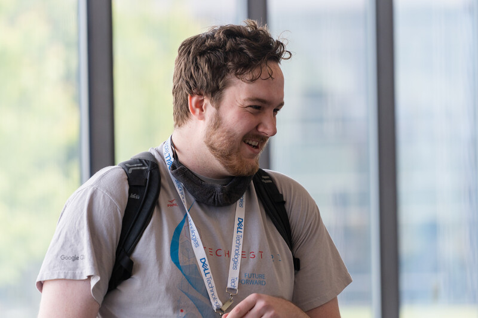{fig-align="center" height="250"}
:::
::: {.column width="33%"}
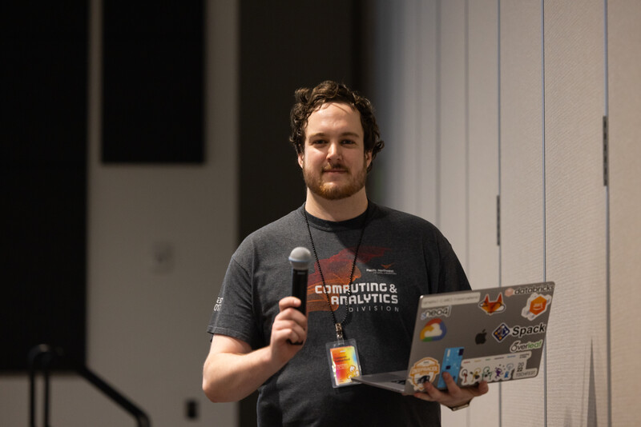{fig-align="center" height="250"}
:::
::: {.column width="33%"}
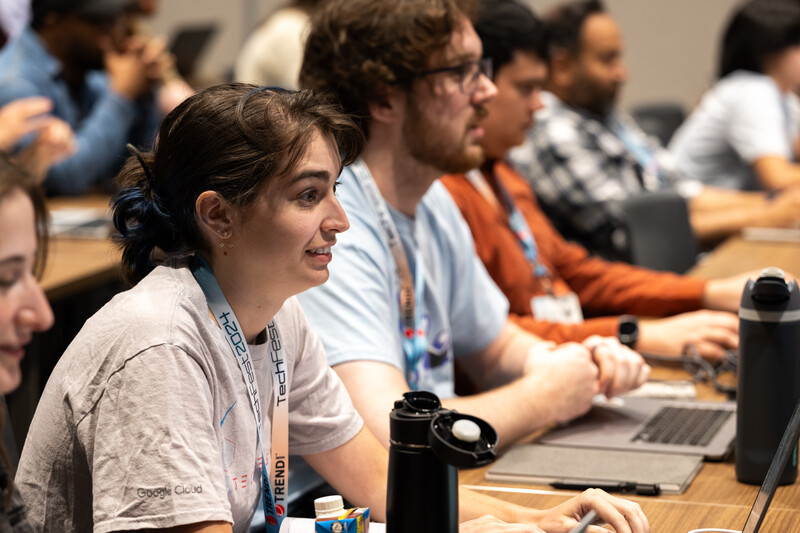{fig-align="center" height="250"}
:::
::::

I presented at PNNL's annual science festival three years running.

### My PNNL Desk

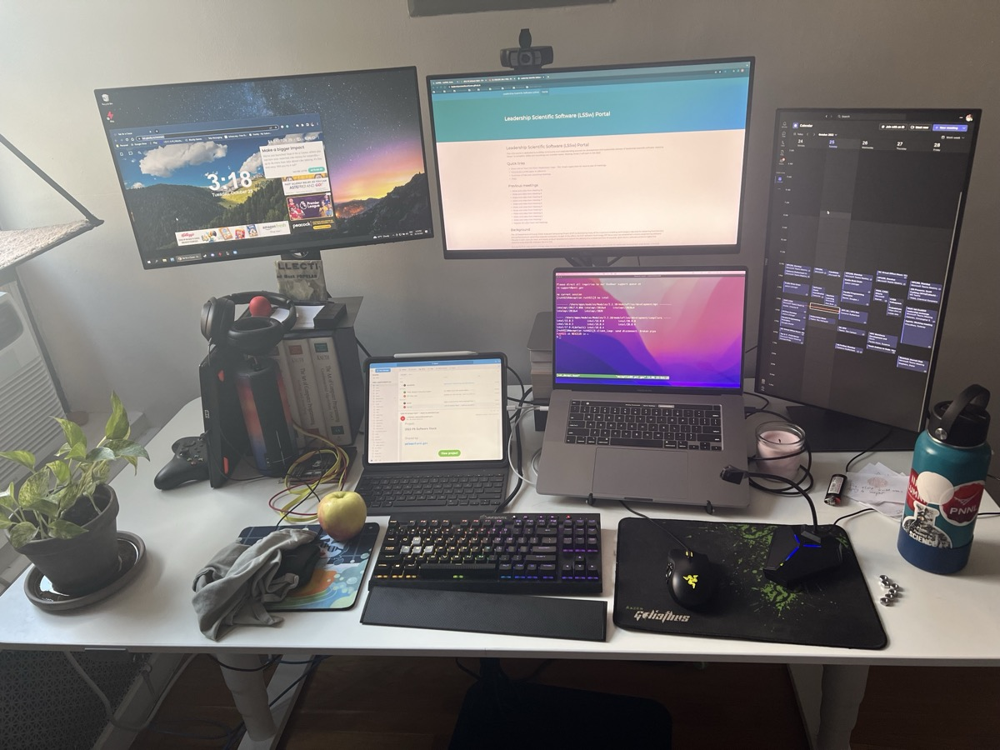{fig-align="center" height="400"}

### Adjunct Professor — Fordham University (2024)

{fig-align="center" height="300"}

Taught **CISC2200 — Data Structures** in the Fall '24 semester at Fordham in Manhattan. Updated the syllabus from C++17 to C++23.

[Course site: dsm.fordham.edu/~rrutherford4](https://www.dsm.fordham.edu/~rrutherford4/)

### AWS — Centre for Quantum Computing

:::: {.columns}
::: {.column width="50%"}
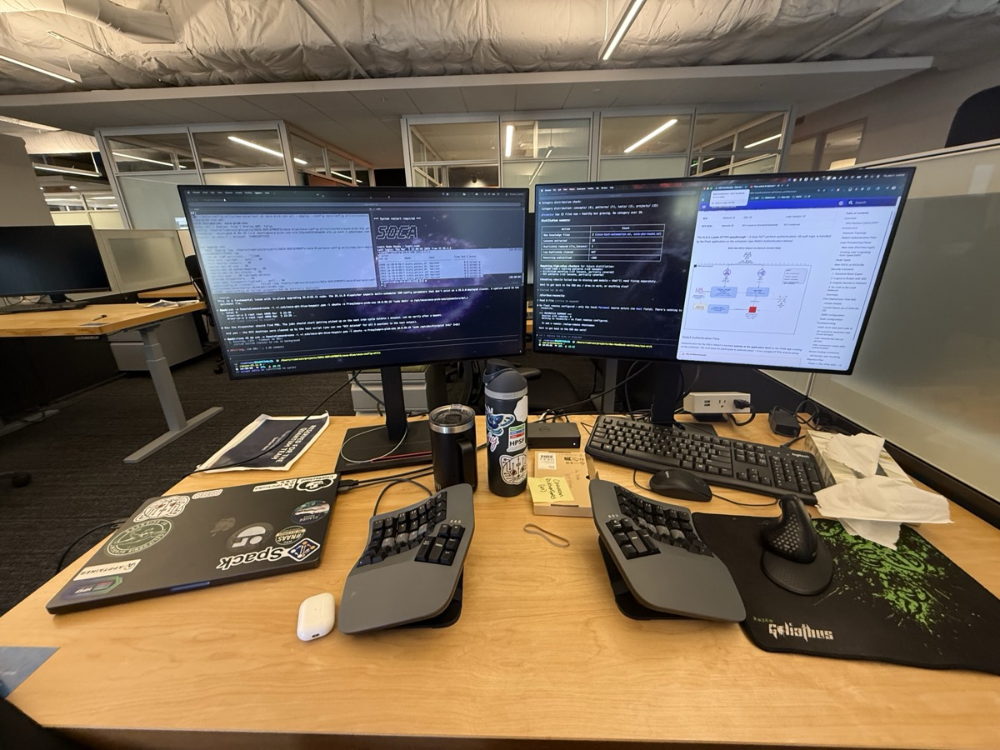{fig-align="center" height="300"}
:::
::: {.column width="50%"}
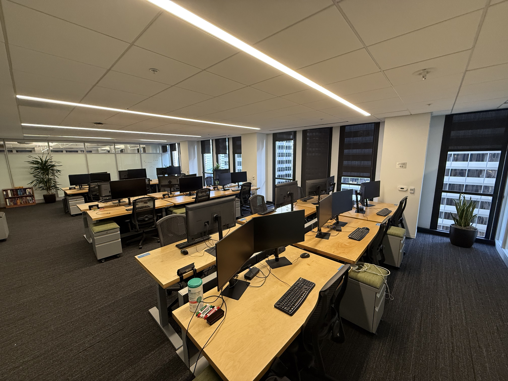{fig-align="center" height="300"}
:::
::::

Now I work at Amazon Web Services in San Francisco, supporting the Centre for Quantum Computing (CQC).

## What is HPC / Cloud / Quantum?

### High Performance Computing (HPC)

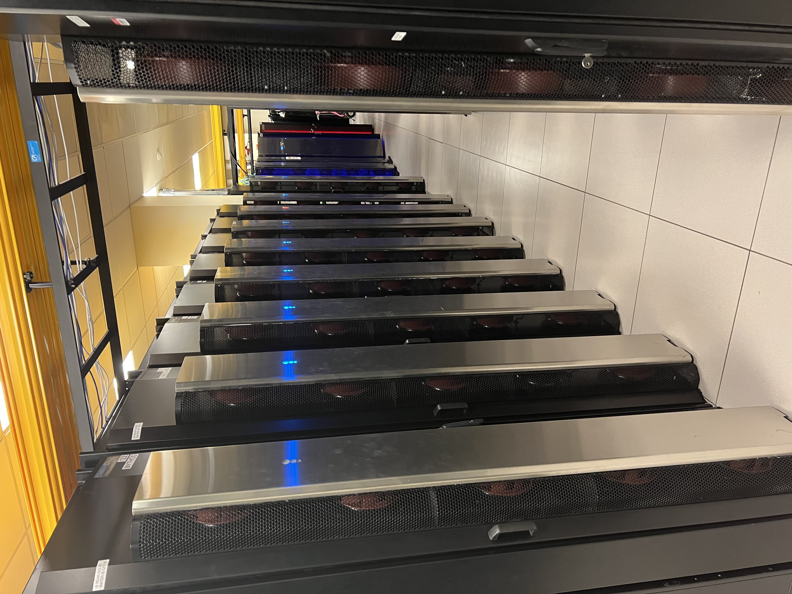{fig-align="center" height="300"}

**Supercomputers** — thousands of computers linked together to solve problems too big for any single machine.

- Climate modeling, drug discovery, physics simulations
- The fastest can do **quintillions** of calculations per second
- Think of it like having 100,000 laptops all working on the same problem

### ORNL Frontier — #1 Supercomputer in the World

{fig-align="center" height="400"}

This is the machine my software ran on. Over 9,000 nodes, each more powerful than any gaming PC.

### Cloud Computing & AWS

:::: {.columns}
::: {.column width="50%"}

:::
::: {.column width="50%"}
Amazon Web Services lets anyone rent supercomputer-level resources:

- No need to buy hardware — just pay for what you use
- Scientists, startups, and students all use it
- Powers Netflix, Twitch, and Alexa
- **My job:** making it easy for researchers to run HPC in the cloud
:::
::::

### The Centre for Quantum Computing (CQC)

AWS is building a quantum computer from the ground up.

This is from our [Nature paper](https://www.nature.com/articles/s41586-025-08642-7) — designing the hardware and error correction needed for useful quantum computing.

### The Ocelot Chip

AWS's quantum chip — designed to implement quantum error correction at scale.

### Simulating Quantum Hardware with Palace

:::: {.columns}
::: {.column width="35%"}

[**Palace**](https://awslabs.github.io/palace/) — PArallel LArge-scale Computational Electromagnetics

Open-source software by AWS for simulating quantum chip designs before building them.
:::
::: {.column width="65%"}

:::
::::

Check out the [single transmon example](https://awslabs.github.io/palace/dev/examples/transmon/) — this is the kind of simulation I support.

::: {.notes}
This connects HPC and quantum — we use classical supercomputers to simulate and design quantum hardware. It's all connected.
:::

### Quantum Computing

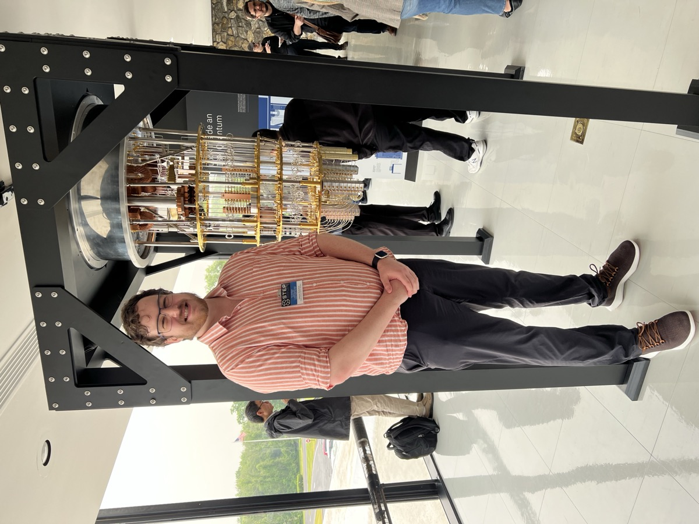{fig-align="center" height="350"}

These machines have to be cooled to near **absolute zero** (-459F) to work. Quantum computing uses the laws of quantum physics to solve certain problems exponentially faster than any classical computer.

### Inside an IBM Quantum Lab

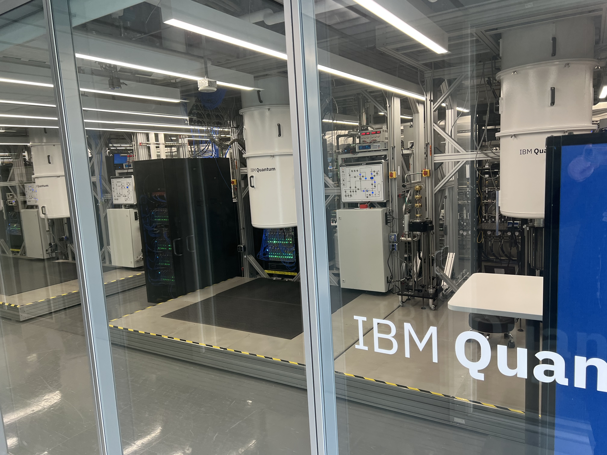{fig-align="center" height="400"}

The gold wiring carries quantum signals. Each of those cylinders is a dilution refrigerator.

### Why This Matters For You

**Math is the shared language** across all of these fields:

- HPC, cloud, quantum, AI — they all come back to **math and computation**
- Computers are the machines we build to do the calculations — but the thinking starts with math
- You don't need to know everything now — I started with just math and curiosity
- The path isn't always straight — Australia → tiny college → national lab → AWS

### {background-iframe="https://wall.sli.do/event/rkxz9zbJRtoR8Z9ggJ3rMa?section=245085f5-655c-4175-adec-962561bdb19e" background-interactive="true"}

<!-- Presenter admin link: https://auth.slido.com/eu1/api/latest/the-auth/user/lifecycle-process/shareable-link/init?token=82d5358fb32f77c8a10b19ca0a7fcf2f7d4372cd379154c6392fcd071b75d4ba -->

## Thank You!

### Find Me Online

- GitHub: [cameronrutherford](https://github.com/cameronrutherford)
- LinkedIn: [robert-c-rutherford](https://www.linkedin.com/in/robert-c-rutherford/)
